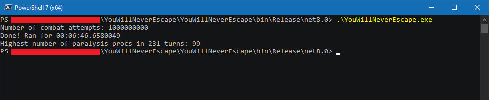

Dear Austin,

This program runs the simulation 1,000,000,000 times in 6 minutes 45 seconds.

This will be very dependent on your CPU, of course; here are the specs for mine:

	Intel(R) Core(TM) i7-4790 CPU @ 3.60GHz
	
	Base speed:	3.60 GHz
	Sockets:	1
	Cores:	4
	Logical processors:	8
	Virtualization:	Enabled
	L1 cache:	256 KB
	L2 cache:	1.0 MB
	L3 cache:	8.0 MB

Please ensure your CPU fan is working, and that its heatsink is properly fastened: this application uses multithreading to consume 100% of every core of your CPU to run the simulation. Trying to do anything else meaningful with your computer while this program runs may lead to frustration.

Sincerely,

Ben